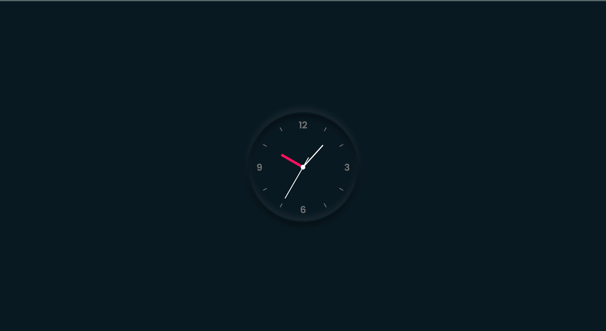

# TimeCraft - Vanilla JS Analog Clock

[Live Preview]()

TimeCraft is a beautiful analog clock built entirely using HTML, CSS, and Vanilla JavaScript. This project is part of the 30-day Vanilla JS challenge and represents Day 2 completion.

## Features

- Real-time clock updates: Utilizes JavaScript's `Date` object to obtain real-time data and update the clock hands accordingly.
- Stunning design: Implements advanced CSS techniques, including Neumorphism design, to create an elegant clock face and hands.
- Responsive layout: Uses media queries to ensure the clock adapts seamlessly to different screen sizes, making it accessible on various devices.

## Getting Started

1. Clone this repository to your local machine.
2. Open `index.html` in your web browser.
3. Voila! You should see the TimeCraft analog clock ticking away.

## Future Enhancements

- **Digital Time Display**: Adding a digital time display for better accessibility and convenience.
- **Customization Options**: Providing users with the ability to customize the clock face design and choose different styles.
- **Interactive Features**: Incorporating interactive elements like alarm settings or time zone conversion for added functionality.

## Credits

- UI Inspiration: [Javascript Clock | CSS Neumorphism Working Analog Clock UI Design](https://www.youtube.com/watch?v=weZFfrjF-k4) by Online Tutorials on YouTube.

---

Enjoy TimeCraft and happy coding! ⏰✨